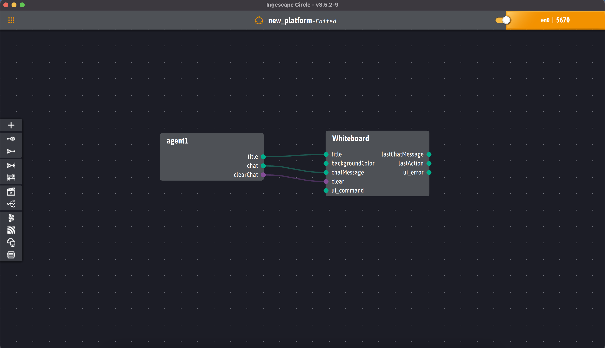

# Projet IHM

This project was bootstrapped with [Create React App](https://github.com/facebook/create-react-app).

## Available Scripts

In the project directory, you can run:

### `npm start`

Runs the app in the development mode.\
Open [http://localhost:3000](http://localhost:3000) to view it in the browser.

The page will reload if you make edits.\
You will also see any lint errors in the console.

### `node src/whiteBoardConnection.js`

Launches a server we created on the port 3001. This server is used by the react app
to manage our agent that interacts with the whiteboard.

## How to run the app?
If you want to use our app, be sure you let ports 3000, 3001 and 5670 available.\
Then download the [whiteboard](https://ingescape.com/n7/) and the [ingescape circle tool](https://ingescape.com/fr/get/).\
Run both and launch the whiteBoardConnection server and connect our "agent1" on ingescape circle like that:
\
Finally, enjoy our app!\
PS: Sometimes it happens that the whiteboard get fixed. To correct it, restart the whiteBoardConnection server.